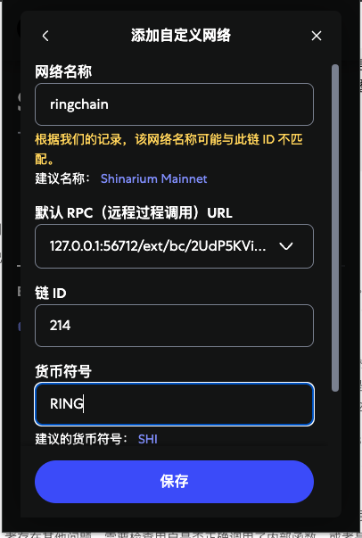
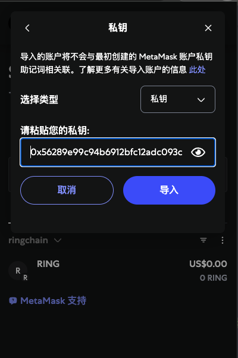
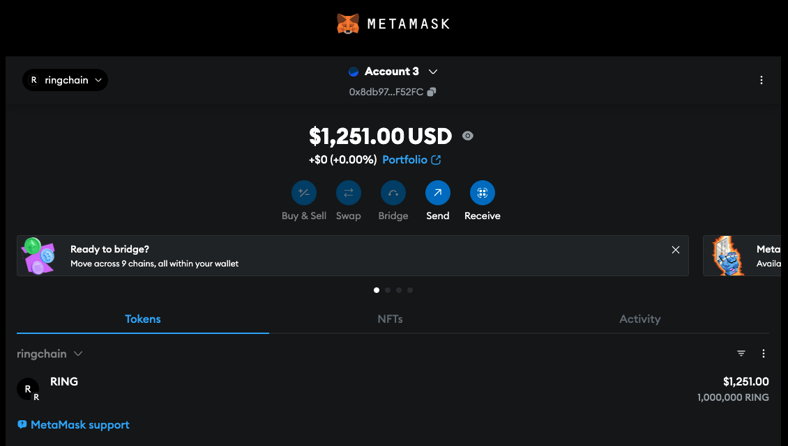
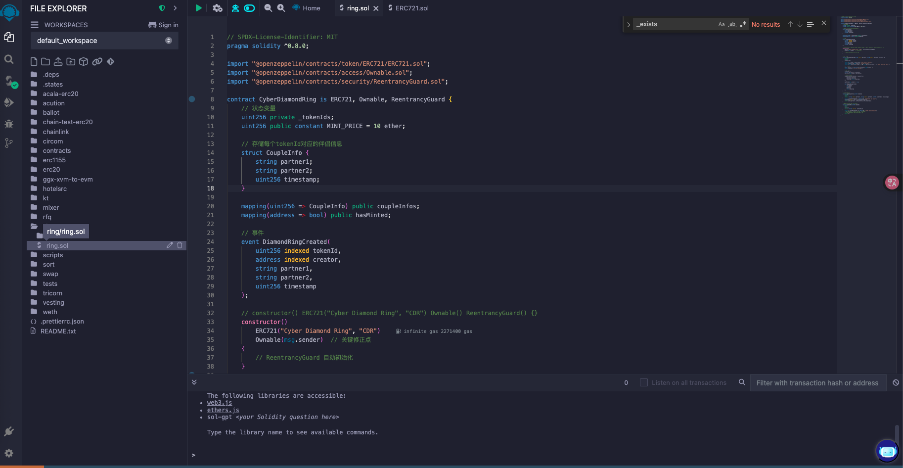
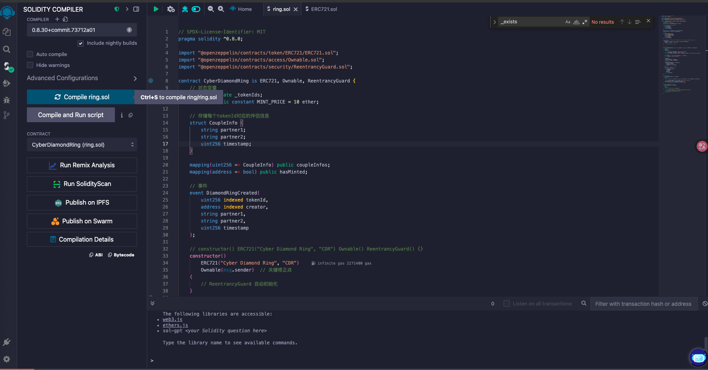
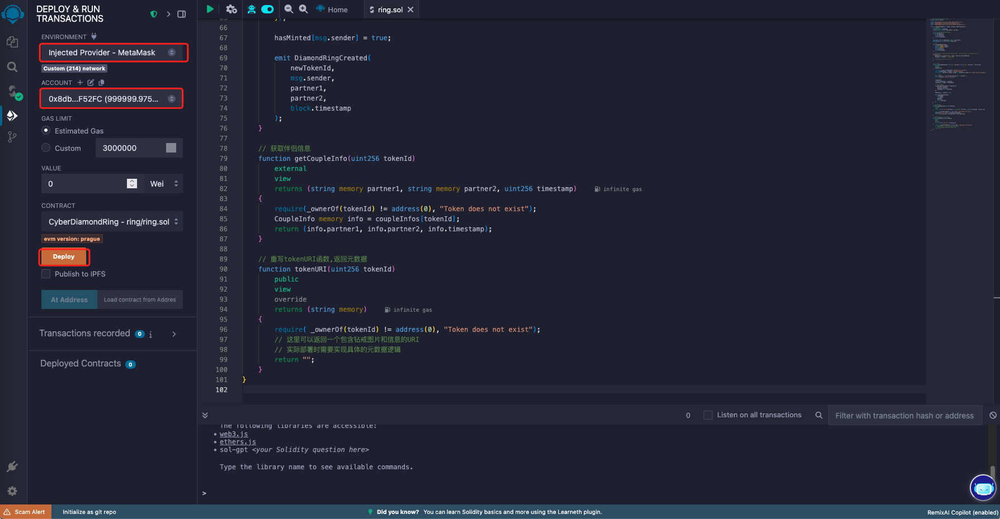
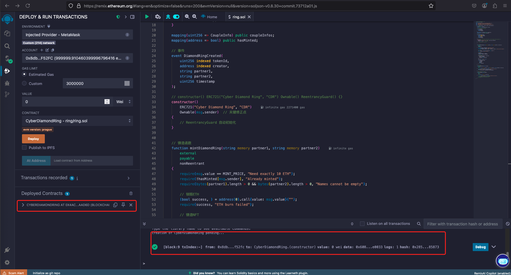
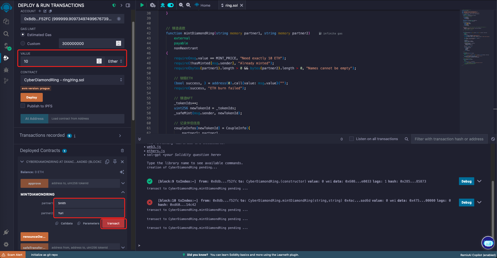
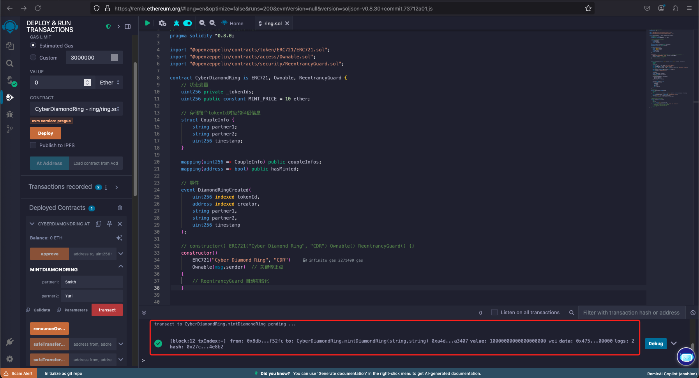

Cyber ​​Diamond Ring: Using blockchain as a melting pot, destroying tokens to forge eternal love - enter the names of both parties to generate a unique encrypted love certificate, making each destruction a romantic atomic reorganization of the metaverse

赛博钻戒：以区块链为熔炉，销毁token铸刻永恒之爱——输入双方姓名，生成独一无二的加密爱情凭证，让每一次销毁都成为元宇宙的浪漫原子重组

# install avalanche-l1 cli
curl -sSfL https://raw.githubusercontent.com/ava-labs/avalanche-cli/main/scripts/install.sh | sh -s

# set avalanche-l1 env to PATH
echo 'export PATH=~/bin:$PATH' >> ~/.bashrc
source ~/.bashrc


echo 'export PATH=~/bin:$PATH' >> ~/.zshrc
source ~/.zshrc

# create chain
avalanche blockchain create ringchain

# choose vm
Subnet-EVM

# choose validator management type
Proof Of Authority

# choose address do you want to enable
Get address from an existing stored key (created from avalanche key create or avalanche key import)

# choose address key as controller of ValidatorManager contract, (ewoq is publicly exposed for localhost test)
ewoq

# choose default values for the Blockchain configuration
I want to use defaults for a test environment

# import chainid
214

# set Token Symbol
RING

# then, we create chain sucess
```
% avalanche blockchain create ringchain
✔ Subnet-EVM
✔ Proof Of Authority
✔ Get address from an existing stored key (created from avalanche key create or avalanche key import)
✔ ewoq
✓ Validator Manager Contract owner address 0x8db97C7cEcE249c2b98bDC0226Cc4C2A57BF52FC
✔ I want to use defaults for a test environment
Chain ID: 214
Token Symbol: RING
prefunding address 0x8db97C7cEcE249c2b98bDC0226Cc4C2A57BF52FC with balance 1000000000000000000000000
Installing subnet-evm-v0.7.3...
subnet-evm-v0.7.3 installation successful
File /Users/liyihang/.avalanche-cli/subnets/ringchain/chain.json successfully written
✓ Successfully created blockchain configuration
Run 'avalanche blockchain describe' to view all created addresses and what their roles are
```

# deploy chain
avalanche blockchain deploy ringchain --local

```
% avalanche blockchain deploy ringchain --local
Deploying [ringchain] to Local Network

Installing avalanchego-v1.13.0...
avalanchego-v1.13.0 installation successful
AvalancheGo path: /Users/liyihang/.avalanche-cli/bin/avalanchego/avalanchego-v1.13.0/avalanchego

Booting Network. Wait until healthy...

Node logs directory: /Users/liyihang/.avalanche-cli/runs/network_20250525_231103/<NodeID>/logs

Network ready to use.

Using [P-custom18jma8ppw3nhx5r4ap8clazz0dps7rv5u9xde7p] to be set as a change owner for leftover AVAX

AvalancheGo path: /Users/liyihang/.avalanche-cli/bin/avalanchego/avalanchego-v1.13.0/avalanchego

✓ Local cluster ringchain-local-node-local-network not found. Creating...
Starting local avalanchego node using root: /Users/liyihang/.avalanche-cli/local/ringchain-local-node-local-network ...
✓ Booting Network. Wait until healthy...
✓ Avalanchego started and ready to use from /Users/liyihang/.avalanche-cli/local/ringchain-local-node-local-network

Node logs directory: /Users/liyihang/.avalanche-cli/local/ringchain-local-node-local-network/<NodeID>/logs

Network ready to use.

URI: http://127.0.0.1:56712
NodeID: NodeID-GE8ShScZEKZwbS9C4RyuxHdwJrdJyToY9

Your blockchain control keys: [P-custom18jma8ppw3nhx5r4ap8clazz0dps7rv5u9xde7p]
Your blockchain auth keys for chain creation: [P-custom18jma8ppw3nhx5r4ap8clazz0dps7rv5u9xde7p]
CreateSubnetTx fee: 0.000010278 AVAX
Blockchain has been created with ID: 2W9boARgCWL25z6pMFNtkCfNA5v28VGg9PmBgUJfuKndEdhrvw
Now creating blockchain...
CreateChainTx fee: 0.000129558 AVAX
+--------------------------------------------------------------------+
|                         DEPLOYMENT RESULTS                         |
+---------------+----------------------------------------------------+
| Chain Name    | ringchain                                          |
+---------------+----------------------------------------------------+
| Subnet ID     | 2W9boARgCWL25z6pMFNtkCfNA5v28VGg9PmBgUJfuKndEdhrvw |
+---------------+----------------------------------------------------+
| VM ID         | sPVpdjGzPPRDQMUvR98tMkygcRhDNyhB7zeAxV14NdaJ8DSWk  |
+---------------+----------------------------------------------------+
| Blockchain ID | 2UdP5KViXuCMrew4HSP8fj4RymPSkSQWCYJpB5B2k8jzPwSQ7n |
+---------------+                                                    |
| P-Chain TXID  |                                                    |
+---------------+----------------------------------------------------+
Now calling ConvertSubnetToL1Tx...
ConvertSubnetToL1Tx fee: 0.000036992 AVAX
ConvertSubnetToL1Tx ID: LtZP2Sw7PE4qZ2xGndDF4sZsearVMm2vFCpcMCC9CcqjDa3mQ
Waiting for the Subnet to be converted into a sovereign L1 ... 100% [===============]           

Validator Manager Protocol: ACP99
Restarting node NodeID-GE8ShScZEKZwbS9C4RyuxHdwJrdJyToY9 to track newly deployed subnet/s
Waiting for blockchain 2UdP5KViXuCMrew4HSP8fj4RymPSkSQWCYJpB5B2k8jzPwSQ7n to be bootstrapped
✓ Local Network successfully tracking ringchain
✓ Checking if node is healthy...
✓ Node is healthy after 0 seconds
Initializing Proof of Authority Validator Manager contract on blockchain ringchain ...
✓ Proof of Authority Validator Manager contract successfully initialized on blockchain ringchain

Your L1 is ready for on-chain interactions.

RPC Endpoint: http://127.0.0.1:56712/ext/bc/2UdP5KViXuCMrew4HSP8fj4RymPSkSQWCYJpB5B2k8jzPwSQ7n/rpc
ICM Messenger successfully deployed to ringchain (0x253b2784c75e510dD0fF1da844684a1aC0aa5fcf)
ICM Registry successfully deployed to ringchain (0x49A71d8d991556Ac8c400FCC2f322107B6EE6CF6)
ICM Messenger successfully deployed to c-chain (0x253b2784c75e510dD0fF1da844684a1aC0aa5fcf)
ICM Registry successfully deployed to c-chain (0x17aB05351fC94a1a67Bf3f56DdbB941aE6c63E25)
✓ ICM is successfully deployed

Generating relayer config file at /Users/liyihang/.avalanche-cli/runs/network_20250525_231103/icm-relayer-config.json
Relayer version icm-relayer-v1.6.4
Installing Relayer
✗ Relayer is not deployed due to: failed downloading https://github.com/ava-labs/icm-services/releases/download/icm-relayer-v1.6.4/icm-relayer_1.6.4_darwin_arm64.tar.gz: Get "https://github.com/ava-labs/icm-services/releases/download/icm-relayer-v1.6.4/icm-relayer_1.6.4_darwin_arm64.tar.gz": dial tcp 20.205.243.166:443: i/o timeout

+---------------------------------------------------------------------------------------------------------------------------------+
|                                                            RINGCHAIN                                                            |
+---------------+-----------------------------------------------------------------------------------------------------------------+
| Name          | ringchain                                                                                                       |
+---------------+-----------------------------------------------------------------------------------------------------------------+
| VM ID         | sPVpdjGzPPRDQMUvR98tMkygcRhDNyhB7zeAxV14NdaJ8DSWk                                                               |
+---------------+-----------------------------------------------------------------------------------------------------------------+
| VM Version    | v0.7.3                                                                                                          |
+---------------+-----------------------------------------------------------------------------------------------------------------+
| Validation    | Proof Of Authority                                                                                              |
+---------------+--------------------------+--------------------------------------------------------------------------------------+
| Local Network | ChainID                  | 214                                                                                  |
|               +--------------------------+--------------------------------------------------------------------------------------+
|               | SubnetID                 | 2W9boARgCWL25z6pMFNtkCfNA5v28VGg9PmBgUJfuKndEdhrvw                                   |
|               +--------------------------+--------------------------------------------------------------------------------------+
|               | Owners (Threhold=1)      | P-custom18jma8ppw3nhx5r4ap8clazz0dps7rv5u9xde7p                                      |
|               +--------------------------+--------------------------------------------------------------------------------------+
|               | BlockchainID (CB58)      | 2UdP5KViXuCMrew4HSP8fj4RymPSkSQWCYJpB5B2k8jzPwSQ7n                                   |
|               +--------------------------+--------------------------------------------------------------------------------------+
|               | BlockchainID (HEX)       | 0xc26d59b15f57fef5efe5c06f40da4d1d963aac77deae0a857898f72a316e24f3                   |
|               +--------------------------+--------------------------------------------------------------------------------------+
|               | RPC Endpoint             | http://127.0.0.1:56712/ext/bc/2UdP5KViXuCMrew4HSP8fj4RymPSkSQWCYJpB5B2k8jzPwSQ7n/rpc |
+---------------+--------------------------+--------------------------------------------------------------------------------------+

+------------------------------------------------------------------------------------+
|                                         ICM                                        |
+---------------+-----------------------+--------------------------------------------+
| Local Network | ICM Messenger Address | 0x253b2784c75e510dD0fF1da844684a1aC0aa5fcf |
|               +-----------------------+--------------------------------------------+
|               | ICM Registry Address  | 0x49A71d8d991556Ac8c400FCC2f322107B6EE6CF6 |
+---------------+-----------------------+--------------------------------------------+

+---------------------------+
|           TOKEN           |
+--------------+------------+
| Token Name   | RING Token |
+--------------+------------+
| Token Symbol | RING       |
+--------------+------------+

+----------------------------------------------------------------------------------------------------------------------------------------+
|                                                        INITIAL TOKEN ALLOCATION                                                        |
+-------------------------+------------------------------------------------------------------+---------------+---------------------------+
| DESCRIPTION             | ADDRESS AND PRIVATE KEY                                          | AMOUNT (RING) | AMOUNT (WEI)              |
+-------------------------+------------------------------------------------------------------+---------------+---------------------------+
| Used by ICM             | 0x117cE4272fd3657fD08e77Aa6931d4b040e1972a                       | 600           | 600000000000000000000     |
| cli-teleporter-deployer | ae786d3992b69512c94ba4119a8e90fa6bf1116aeecc903aefe99ba4c794484b |               |                           |
+-------------------------+------------------------------------------------------------------+---------------+---------------------------+
| Main funded account     | 0x8db97C7cEcE249c2b98bDC0226Cc4C2A57BF52FC                       | 1000000       | 1000000000000000000000000 |
| ewoq                    | 56289e99c94b6912bfc12adc093c9b51124f0dc54ac7a766b2bc5ccf558d8027 |               |                           |
+-------------------------+------------------------------------------------------------------+---------------+---------------------------+

+----------------------------------------------------------------------------------------------------------------------------------+
|                                                          SMART CONTRACTS                                                         |
+----------------------------------------+--------------------------------------------+--------------------------------------------+
| DESCRIPTION                            | ADDRESS                                    | DEPLOYER                                   |
+----------------------------------------+--------------------------------------------+--------------------------------------------+
| ACP99 Compatible PoA Validator Manager | 0x0C0DEbA5E0000000000000000000000000000000 |                                            |
+----------------------------------------+--------------------------------------------+--------------------------------------------+
| Transparent Proxy                      | 0x0Feedc0de0000000000000000000000000000000 |                                            |
+----------------------------------------+--------------------------------------------+--------------------------------------------+
| Validator Messages Lib                 | 0x9C00629cE712B0255b17A4a657171Acd15720B8C |                                            |
+----------------------------------------+--------------------------------------------+--------------------------------------------+
| Proxy Admin                            | 0xC0fFEE1234567890aBCdeF1234567890abcDef34 | 0x8db97C7cEcE249c2b98bDC0226Cc4C2A57BF52FC |
+----------------------------------------+--------------------------------------------+--------------------------------------------+

+----------------------------------------------------------------------+
|                      INITIAL PRECOMPILE CONFIGS                      |
+------------+-----------------+-------------------+-------------------+
| PRECOMPILE | ADMIN ADDRESSES | MANAGER ADDRESSES | ENABLED ADDRESSES |
+------------+-----------------+-------------------+-------------------+
| Warp       | n/a             | n/a               | n/a               |
+------------+-----------------+-------------------+-------------------+

+--------------------------------------------------------------------------------------------------+
|                                        RINGCHAIN RPC URLS                                        |
+-----------+--------------------------------------------------------------------------------------+
| Localhost | http://127.0.0.1:56712/ext/bc/2UdP5KViXuCMrew4HSP8fj4RymPSkSQWCYJpB5B2k8jzPwSQ7n/rpc |
+-----------+--------------------------------------------------------------------------------------+

+------------------------------------------------------------------+
|                           PRIMARY NODES                          |
+------------------------------------------+-----------------------+
| NODE ID                                  | LOCALHOST ENDPOINT    |
+------------------------------------------+-----------------------+
| NodeID-7Xhw2mDxuDS44j42TCB6U5579esbSt3Lg | http://127.0.0.1:9650 |
+------------------------------------------+-----------------------+
| NodeID-MFrZFVCXPv5iCn6M9K6XduxGTYp891xXZ | http://127.0.0.1:9652 |
+------------------------------------------+-----------------------+
+-------------------------------------------------------------------------------+
|                                    L1 NODES                                   |
+------------------------------------------+------------------------+-----------+
| NODE ID                                  | LOCALHOST ENDPOINT     | L1        |
+------------------------------------------+------------------------+-----------+
| NodeID-GE8ShScZEKZwbS9C4RyuxHdwJrdJyToY9 | http://127.0.0.1:56712 | ringchain |
+------------------------------------------+------------------------+-----------+

+--------------------------------------------------------------------------------------------------------+
|                                            WALLET CONNECTION                                           |
+-----------------+--------------------------------------------------------------------------------------+
| Network RPC URL | http://127.0.0.1:56712/ext/bc/2UdP5KViXuCMrew4HSP8fj4RymPSkSQWCYJpB5B2k8jzPwSQ7n/rpc |
+-----------------+--------------------------------------------------------------------------------------+
| Network Name    | ringchain                                                                            |
+-----------------+--------------------------------------------------------------------------------------+
| Chain ID        | 214                                                                                  |
+-----------------+--------------------------------------------------------------------------------------+
| Token Symbol    | RING                                                                                 |
+-----------------+--------------------------------------------------------------------------------------+
| Token Name      | RING Token                                                                           |
+-----------------+--------------------------------------------------------------------------------------+

Relayer is not deployed due to: failed downloading https://github.com/ava-labs/icm-services/releases/download/icm-relayer-v1.6.4/icm-relayer_1.6.4_darwin_arm64.tar.gz: Get "https://github.com/ava-labs/icm-services/releases/download/icm-relayer-v1.6.4/icm-relayer_1.6.4_darwin_arm64.tar.gz": dial tcp 20.205.243.166:443: i/o timeout

To deploy a local relayer later on, call `avalanche interchain relayer deploy`
This does not affect L1 operations besides Interchain Messaging
✓ L1 is successfully deployed on Local Network
```

# add local testnet to metamask


# import test key to metamask
56289e99c94b6912bfc12adc093c9b51124f0dc54ac7a766b2bc5ccf558d8027
56289e99c94b6912bfc12adc093c9b51124f0dc54ac7a766b2bc5ccf558d8027



# create ring.sol


# compile ring.sol


# deploy ring.sol



# call CyberDiamondRing

